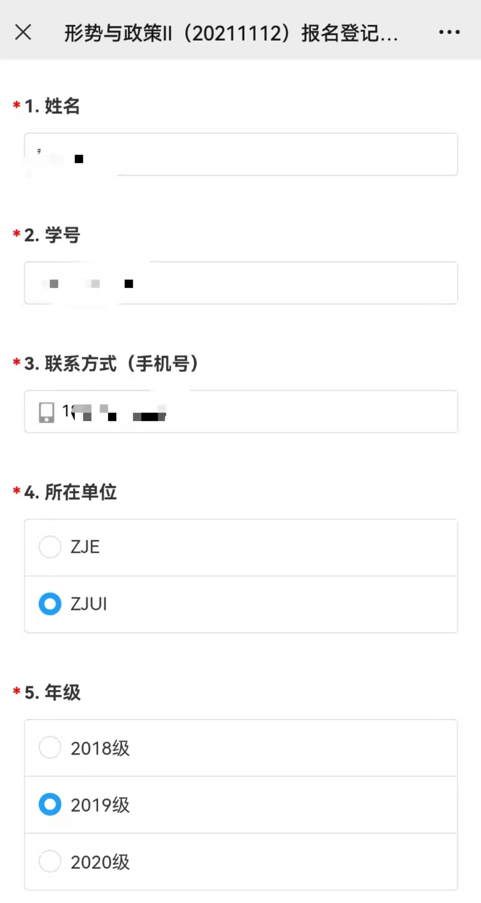

# ZJUI/ZJE 形策问卷定时填写

  需要安装浏览器对应版本chromedriver并保证安装路径在环境变量中

  `pip3 install requirements.txt`
  `python run.py --url 'http://' --hr 20 --min 0 --name '嘉然Diana' --id '114514' --phone 'xxx' --loc 'ZJUI' --grade '2019'`

